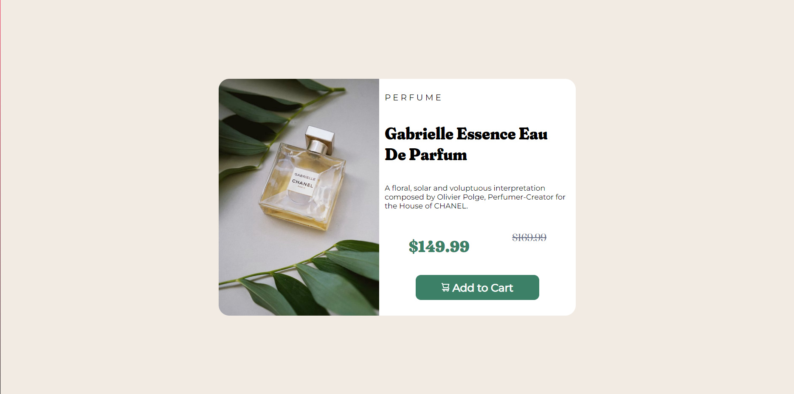
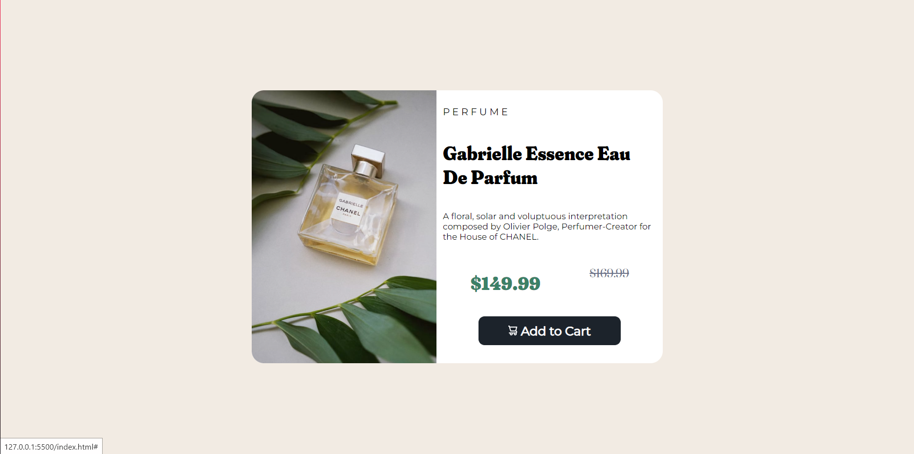
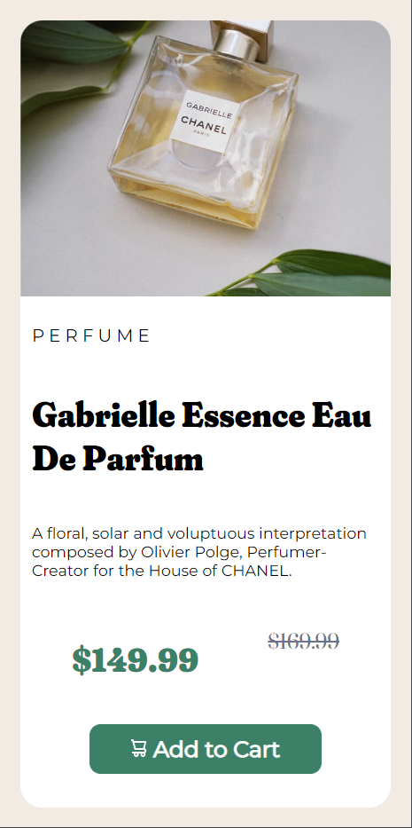

# Frontend Mentor - Product preview card component solution

This is a solution to the [Product preview card component challenge on Frontend Mentor](https://www.frontendmentor.io/challenges/product-preview-card-component-GO7UmttRfa). Frontend Mentor challenges help you improve your coding skills by building realistic projects. 

## Table of contents

- [Overview](#overview)
  - [The challenge](#the-challenge)
  - [Screenshots](#screenshot)
  - [Links](#links)
- [My process](#my-process)
  - [Built with](#built-with)
  - [What I learned](#what-i-learned)
  - [Continued development](#continued-development)
  - [Useful resources](#useful-resources)
- [Author](#author)
- [Acknowledgments](#acknowledgments)

**Note: Delete this note and update the table of contents based on what sections you keep.**

## Overview

### The challenge

Users should be able to:

- View the optimal layout depending on their device's screen size
- See hover and focus states for interactive elements

### Screenshot





### Links

- Solution URL: [Add solution URL here](https://your-solution-url.com)
- Live Site URL: [Add live site URL here](https://your-live-site-url.com)

## My process

### Built with

- Semantic HTML5 markup
- CSS custom properties
- Flexbox

### What I learned

Through this project I learned about: importing fonts, some CSS features (flex, hover and media queries) and I had a better idea about nesting elements on HTML.

You can see some of that below:

HTML

Here I created a box to contain the 2 major elements of the product: the picture ("image") and the texts ("infos"). Since it had only one picture, I used it as a cover background for the div. The text, however, had many more elements such as category, title, desc, etc. so I decied to separate them beacuse I thought it would be easier to identify, apply and reuse the CSS properties later.
```html
    <div class="box-divs">
        <div class="image"></div>
        <div class="infos">
            <p class="category">perfume</p>
            <h1 class="title">Gabrielle Essence Eau De Parfum</h1>
            <p class="desc">A floral, solar and voluptuous interpretation composed by Olivier Polge, 
                Perfumer-Creator for the House of CHANEL.</p>
            <div class="prices">
                <p class="current-price">$149.99</p>
                <p class="prev-price">$169.99</p>
            </div>
            <div class="link">
                <a href="#" class="button-add"> 
                     Add to Cart
                  </a> 
            </div>
        </div>
    </div>
```

CSS

Here are some of those said properties:
```css
.infos{
    width: 55%;
    padding: 10px;
    text-align: left;
    display: flex;
    flex-direction: column;
    justify-content: space-between;
    flex-grow: 1;
    box-sizing: border-box;
}
.category{
    text-transform: uppercase;
    letter-spacing: 4px;
    font-family: 'Montserrat', sans-serif;
}
.title, .desc{
    overflow-y: auto;
}
.title{
    text-transform: capitalize;
    font-family: 'Fraunces', serif;
}
.desc{
    font-family: 'Montserrat', sans-serif;
    font-size: 14px;
}
```
As you can see, some elements have properties in common and specifics ones. Writing it like that helped me to understand the how the effectes would be applied on the elements. 

### Continued development

I had some trouble to understand the measures and displays while nesting, but I found it interesting and I intend to improve that.


### Useful resources

About the text, the following properties helped me a lot:
- [text-transform](https://developer.mozilla.org/en-US/docs/Web/CSS/text-transform) - This helped me setting a default pattern to the title and category of the product. The first one needs to have the first letter of each word capitalized and the second one needs to be all uppercase. 
- [letter-spacing](https://developer.mozilla.org/en-US/docs/Web/CSS/letter-spacing) - As the name suggests, this helped me putting spaces between the letters of "category". 

It does not matter how the text is written/imported, these effects will be applied. So, no more worries about pressing spaces between the html code when changing the category of the product! hahaha

Regarding the flex properties:

When I was researching the use of flex-grow I found this [topic](https://pt.stackoverflow.com/questions/358829/existe-diferença-entre-flex-basis-flex-grow-e-width-qual-é-a-recomendação-de-u) on stackoverflow and those answers were quite explanatory. There I also found this [article](https://origamid.com/projetos/flexbox-guia-completo/) which explains in a lot of details the flex-box property. They were like game changers for me, and I hope they can help you guys too.

## Author

- Nicholas Albuquerque - [@nicoams](https://www.frontendmentor.io/profile/nicoams)

